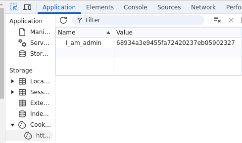
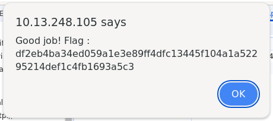

# COOKIE_INJECTION

## 🏴 Flag
```
df2eb4ba34ed059a1e3e89ff4dfc13445f104a1a52295214def1c4fb1693a5c3 
```

## 📌 Extract

Page: [http://{IP}/](http://{IP}/)  
Inspect -> Application -> Cookies -> http://{IP}



Get the current **cookie MD5** value, reverse it to string [(MD5 converter)](https://md5.gromweb.com/).   
``68934a3e9455fa72420237eb05902327(MD5) -> false(string)``  

We can see that the value means "false". We convert "true" to MD5, put it back to the cookie and refresh.  
``true(string) -> b326b5062b2f0e69046810717534cb09(MD5)``



## 🎯 Use
**Cookie injection** involves manipulating the values of cookies sent between the **client** and **server**. If these cookies contain sensitive information (such as sessions or identifiers), an attacker can modify them to **access protected areas** or **alter the application's behavior**.

## 🔒 Prevention
1. Use **Secure Hashing Algorithms** (SHA-256)

2. Implement **Cryptographic Signatures HMAC** (Hash-based Message Authentication Code).  
If the cookie is modified, the HMAC won't match, detecting tampering.

3. Limit Access with **`HttpOnly`**, prevents cookie access via JavaScript, reducing XSS attack risks.

4. Limit Access with **`Secure`**, ensures the cookie is only sent over HTTPS, preventing interception in MITM (Man In The Middle) attacks.

## 📚 Documentation

[owasp.org (Session_hijacking_attack)](https://owasp.org/www-community/attacks/Session_hijacking_attack)  
[motasem-notes.net (cookie-security-explained-owasp-top-10)](https://motasem-notes.net/cookie-security-explained-owasp-top-10/)

### 📖 [Home page](https://github.com/hugo-bourgeon/darkly#README)

