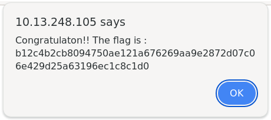

# PATH_TRAVERSAL

## 🏴 Flag
```
b12c4b2cb8094750ae121a676269aa9e2872d07c06e429d25a63196ec1c8c1d0 
```

## 📌 Extract

Page: [http://{IP}/index.php?page=../../../../../../../etc/passwd](http://{IP}/index.php?page=../../../../../../../etc/passwd)  

The URL is manipulated by adding `../../` multiple times to perform a **Path Traversal attack**, moving up the directory structure. This enables access to the system’s /etc/passwd file. By navigating to this page, a pop-up appears showing a flag.



## 🎯 Use
The main goal of a Path Traversal attack is to access files or directories that are not intended to be accessed by the user. This can include:

- **System files** like /etc/passwd (user information).

- **Configuration files** with sensitive data (passwords, API keys).

- **Logs or backups** containing sensitive information.

## 🔒 Prevention

1. **Input validation:** Block characters like ../ or /.  

2. **Restrict permissions:** Limit access to sensitive directories.  

3. **Use secure paths:** Never allow users to specify unchecked relative paths. (function realpath() in PHP)  

## 📚 Documentation

[owasp.org (Path_Traversal)](https://owasp.org/www-community/attacks/Path_Traversal)  
[zerothreat.ai (directory-traversal-attack-explained)](https://zerothreat.ai/blog/directory-traversal-attack-explained)  

### 📖 [Home page](https://github.com/hugo-bourgeon/darkly#readme)

