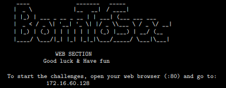

# darkly
42 project - introduction to web security 

## 📑 Introduction

In collaboration with [bcarolle (Ezuker)](https://github.com/Ezuker) and [hubourge (hugo-bourgeon)](https://github.com/hugo-bourgeon)  

The **Darkly** project is a **cybersecurity challenge** where you need to identify and exploit vulnerabilities on a vulnerable website. The goal is to find **14 different vulnerabilities**, such as **SQL injections**, **XSS flaws**, or **session-related vulnerabilities**.💻🔍

This project helps you learn **pentesting techniques**, understand the mechanisms behind **web vulnerabilities**, and develop key skills in cybersecurity.🚀🔐

## 🔗 Table of contents

- [CROSS_SITE_SCRIPTING_(XSS)](https://github.com/hugo-bourgeon/darkly/blob/main/CROSS_SITE_SCRIPTING_(XSS)/Ressources/ressources.md)
- [REMOTE_FILE_INCLUSION_(RFI)](https://github.com/hugo-bourgeon/darkly/blob/main/REMOTE_FILE_INCLUSION_(RFI)/Ressources/ressources.md)
- [LOCAL_FILE_INCLUSION_(LFI)](https://github.com/hugo-bourgeon/darkly/blob/main/LOCAL_FILE_INCLUSION_(LFI)/Ressources/ressources.md)
- [PATH_TRAVERSAL](https://github.com/hugo-bourgeon/darkly/blob/main/PATH_TRAVERSAL/Ressources/ressources.md) 
- [COOKIE_INJECTION](https://github.com/hugo-bourgeon/darkly/blob/main/COOKIE_INJECTION/Ressources/ressources.md)
- [TAMPERING_INPUT](https://github.com/hugo-bourgeon/darkly/blob/main/TAMPERING_INPUT/Ressources/ressources.md)
- [TAMPERING_BYPASS_RESTRICTION](https://github.com/hugo-bourgeon/darkly/tree/main/TAMPERING_BYPASS_RESTRICTION/Ressources/ressources.md)

- [SQL_INJECTION_(Member_Brute_Force)](https://github.com/hugo-bourgeon/darkly/blob/main/SQL_INJECTION_(Member_Brute_Force)/Ressources/ressources.md)
- [SQL_INJECTION_(Member_Images)](https://github.com/hugo-bourgeon/darkly/blob/main/SQL_INJECTION_(Member_Images)/Ressources/ressources.md)
- [SQL_INJECTION_(Member_Sql_Injection)](https://github.com/hugo-bourgeon/darkly/blob/main/SQL_INJECTION_(Member_Sql_Injection)/Ressources/ressources.md)
- [URL_BRUTE_FORCING](https://github.com/hugo-bourgeon/darkly/blob/main/URL_BRUTE_FORCING/Ressources/ressources.md)
- [URL_BRUTE_FORCING_(2)](https://github.com/hugo-bourgeon/darkly/blob/main/URL_BRUTE_FORCING_(2)/Ressources/ressources.md)
- [STORED_XSS](https://github.com/hugo-bourgeon/darkly/blob/main/STORED_XSS/Ressources/ressources.md)
- [HEADER SPOOFING](https://github.com/hugo-bourgeon/darkly/blob/main/HEADER%20SPOOFING/Ressources/ressources.md)

## 🌱 Environment

The **Darkly** project is conducted in a controlled and **isolated environment** to ensure security while testing vulnerabilities. The website is hosted on a **local server**, running on a **virtual machine** (i386) with a provided ISO.

All attacks are performed **ethically** on the provided target, following **responsible disclosure principles**. 🛡️📜